# Практическая 01 · starter

Среда: Windows, Uniform Server, PHP 8.3–8.5. Веб-корень — только `public`.
Полная настройка Apache/PHP/Composer находится в общем справочнике курса.

1. Скопируйте этот проект в отдельную папку, например `C:\WebLabs\pr01`.
2. Установите вариант A/B/C в `config.php`.
3. Настройте учебный VirtualHost на папку `public` этого проекта; URL `http://localhost:8088/`.
4. Проверьте `http://localhost:8088/health.php`.

## TODO текущей работы

- `P01-GET` — `app.php`: Прочитать два количества из GET и проверить готовой quantity().
- `P01-POST` — `app.php`: Прочитать количества из POST, а не из строки запроса.
- `P01-SUM` — `app.php`: Вычислить сумму в минимальных денежных единицах.
- `P01-HEADER` — `app.php`: Установить X-Practice: 01 до вывода тела.

 
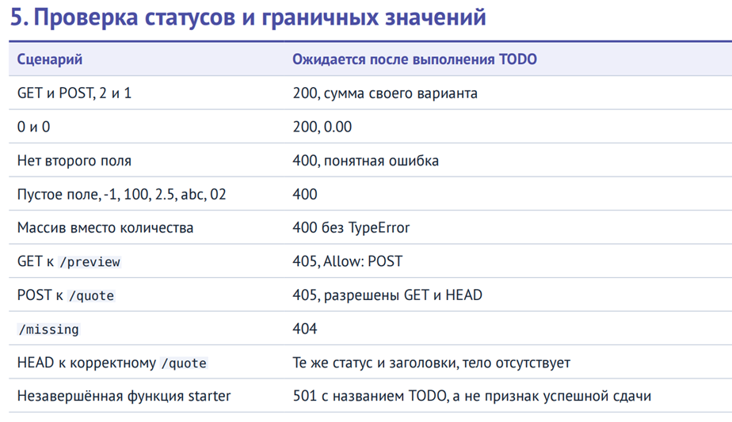
1. GET и POST, 2 и 1
 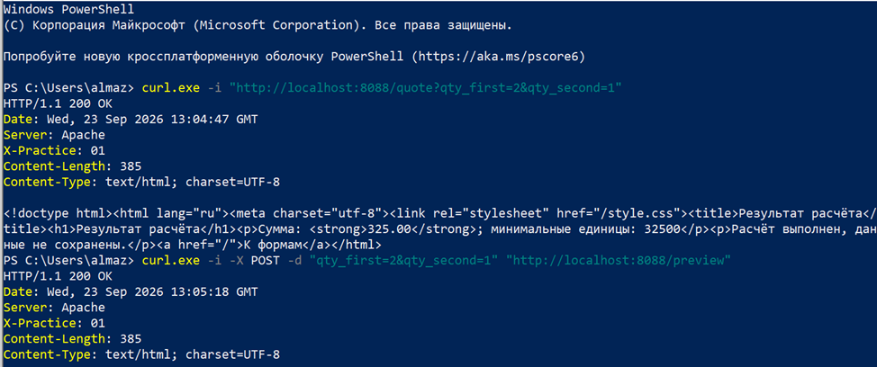

2. 0 и 0
 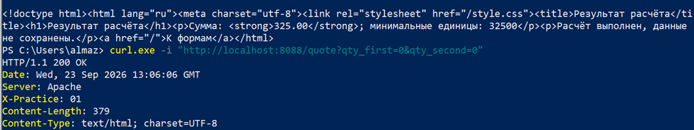

3. Нет второго поля
 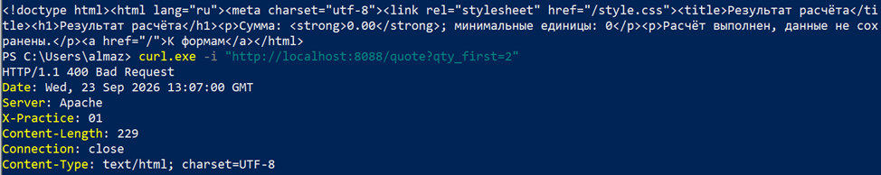

4.  Пустое поле, -1, 100, 2.5, abc, 02

Пустое поле:
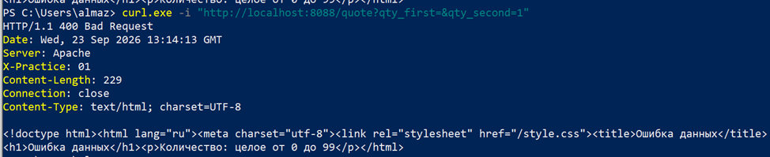

-1:
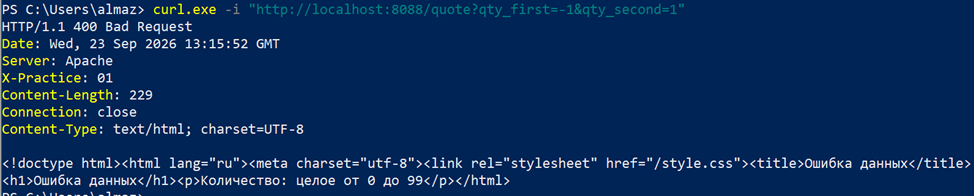
 
100:
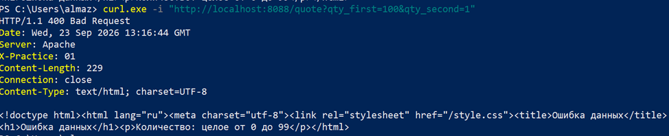
 
2.5:
 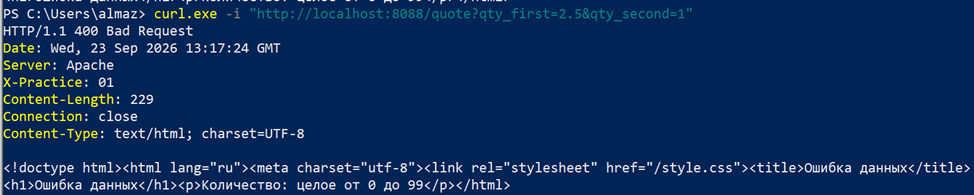


abc:
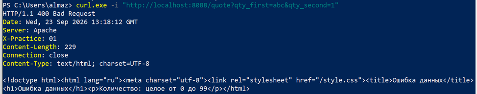
 
02:
 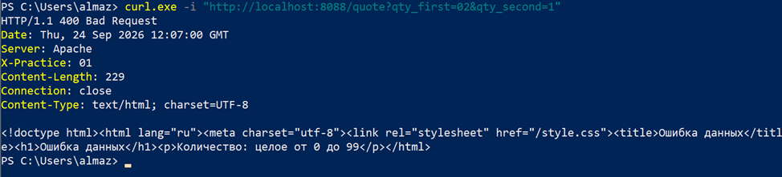

5. Массив вместо количества
 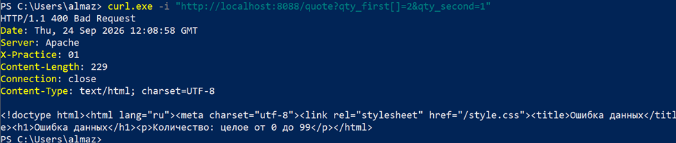

6. GET к /preview
 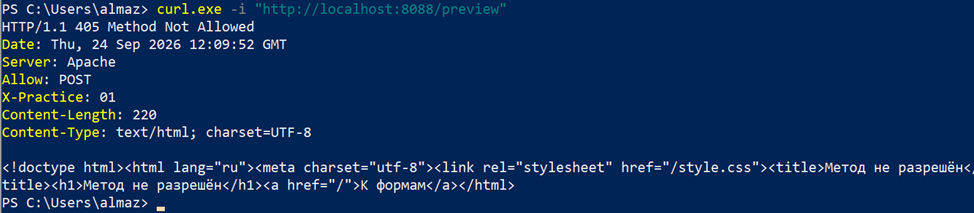

7. POST к /quote
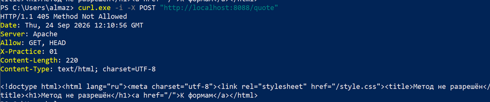
 
8. /missing
 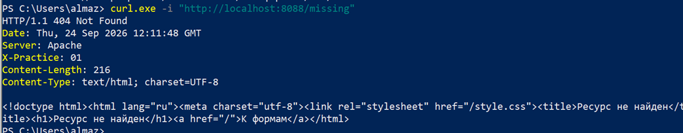

9. HEAD к корректному /quote
 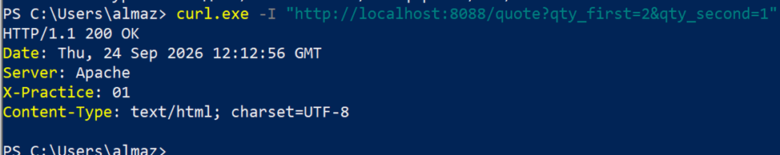

10. Незавершенная функция starter
 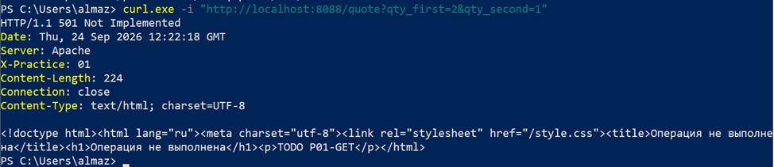


400 bad request:\
```
HTTP/1.1 400 Bad Request
Date: Mon, 21 Sep 2026 11:17:37 GMT
Server: Apache
X-Practice: 01
Content-Length: 229
Connection: close
Content-Type: text/html; charset=UTF-8

<!doctype html><html lang="ru"><meta charset="utf-8"><link rel="stylesheet" href="/style.css"><title>Ошибка данных</title><h1>Ошибка данных</h1><p>Количество: целое от 0 до 99</p></html>

```
```


Контролируемый ответ 501 с названием TODO означает незавершённое задание, а не ошибку установки.
В №3 сначала настройте автозагрузку; в №8 отказ CSRF до выполнения TODO ожидаем.
После выполнения передайте исходники, composer.json/lock (если есть) и короткий README.
Описания учебных TODO можно оставить в комментариях; исполняемые заглушки нужно заменить.
